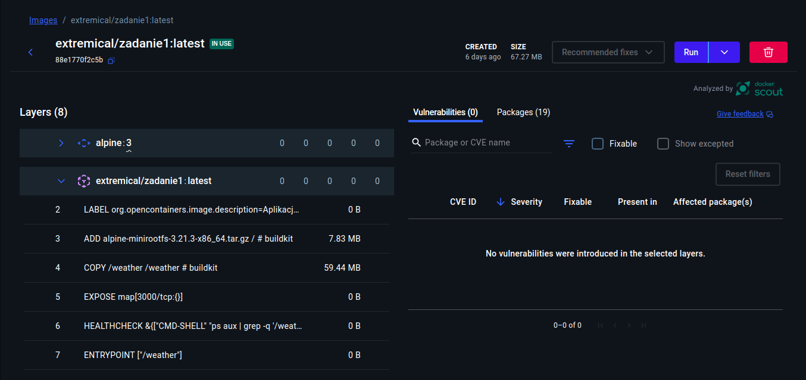
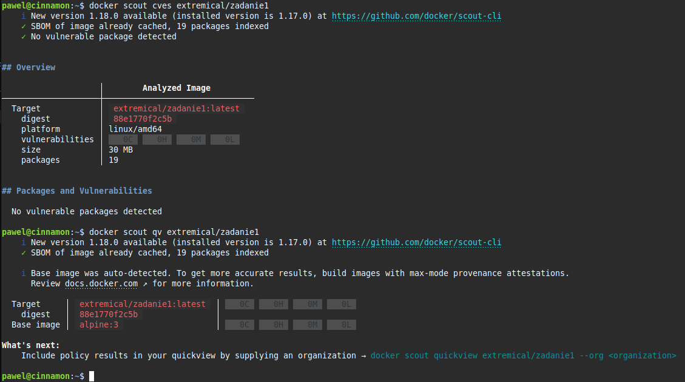
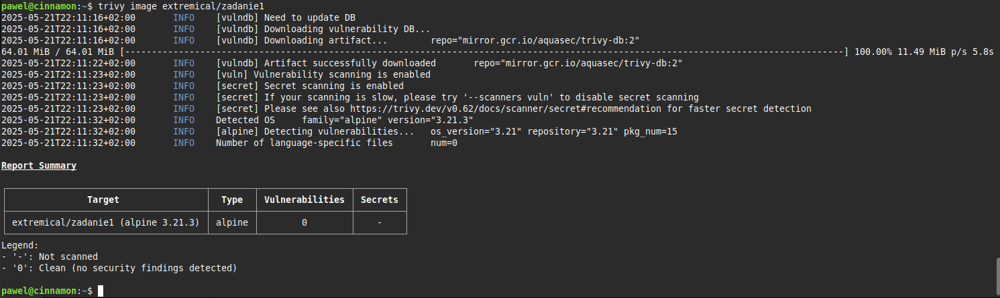
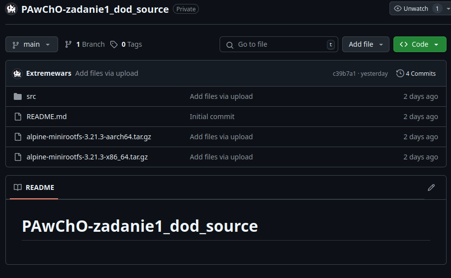
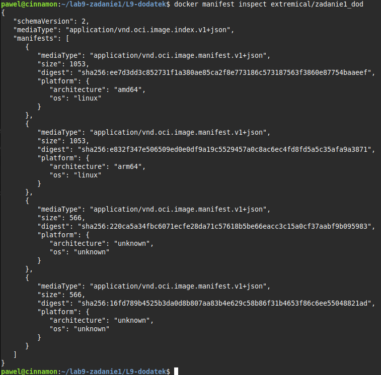
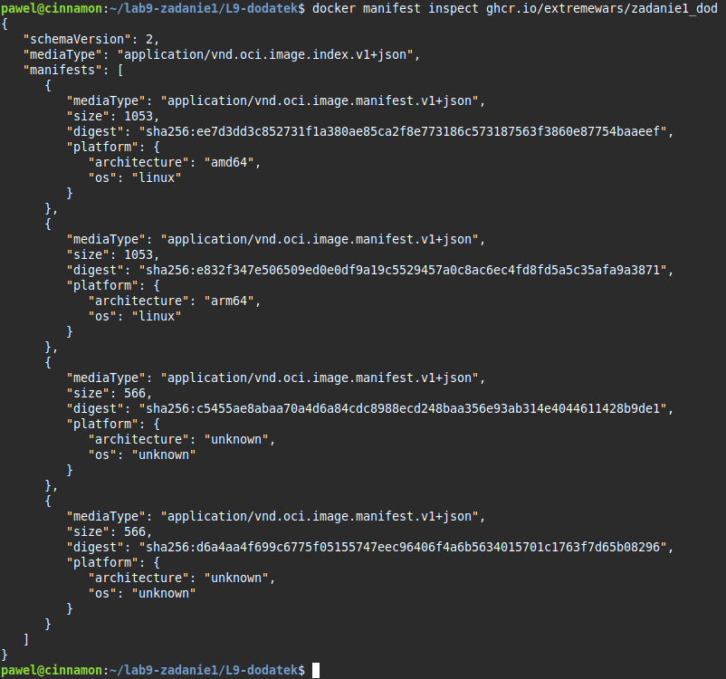

# PAwChO-zadanie1-dodatek

Obraz można pobrać przez:
```bash
docker pull ghcr.io/extremewars/zadanie1_dod:latest
```
```bash
docker pull extremical/zadanie1_dod:latest
```

## Sprawdzenie bezpieczeństwa obrazu

Narzędzie docker scout


```bash
docker scout cves <obraz>
```



Narzędzie trivy
```bash
trivy image <obraz>
```



## Pliki źródłowe znajdują się na prywatnym repozytorium



## Dockerfile

```dockerfile
# syntax=docker/dockerfile:1.4
# Etap pierwszy - utworzenie binarnej wersji aplikacji
FROM --platform=$BUILDPLATFORM node:22-alpine AS build
# Obsługa argumentu architektury
ARG TARGETARCH
# Dodanie git i ssh
RUN apk add --no-cache git openssh
#  Katalog roboczy
WORKDIR /app
# Dodanie klucza hosta github.com do known_hosts
RUN mkdir -p ~/.ssh && ssh-keyscan github.com >> ~/.ssh/known_hosts
# Pobieranie plików przez prywatne repozytorium
RUN --mount=type=ssh git clone git@github.com:Extremewars/PAwChO-zadanie1_dod_source.git .
# Skopiowanie spisu zależności, jeśli się nie zmieniły część warstw zostanie pobrana z cache'a
RUN cp src/package*.json ./ && npm install
# Instalacja pakietu pkg umożliwiającego utworzyć plik wykonywalny projektu
RUN npm install -g pkg
# Skopiowanie plików źródłowych
RUN cp -r src/* ./
# Rozpakowanie plików systemowych dla dwóch różnych architektur
RUN mkdir /app/amd64 && tar -xzf ./alpine-minirootfs-3.21.3-x86_64.tar.gz -C /app/amd64 && rm ./alpine-minirootfs-3.21.3-x86_64.tar.gz
RUN mkdir /app/arm64 && tar -xzf ./alpine-minirootfs-3.21.3-aarch64.tar.gz -C /app/arm64 && rm ./alpine-minirootfs-3.21.3-aarch64.tar.gz
# Utworzenie pliku wykonywalnego w zależności od architektury
RUN if [ "$TARGETARCH" = "arm64" ]; then \
      pkg . --targets node16-arm64 --output /weather; \
    else \
      pkg . --targets node16-x64 --output /weather; \
    fi


# Finalny etap - warstwa scratch
FROM scratch AS prod
ARG TARGETARCH
# Kopiowanie systemu plików dla danej architektury
COPY --from=build /app/${TARGETARCH} /
# Skopiowanie binarnej wersji aplikacji z poprzedniego etapu
COPY --from=build /weather /weather
# Informacje o autorze i opis aplikacji
LABEL org.opencontainers.image.authors="Paweł Olech"
LABEL org.opencontainers.image.title="Zadanie 1 - Aplikacja pogodowa"
LABEL org.opencontainers.image.description="Aplikacja pogodowa w Node.js"
# Sugerowany port - localhost:3000
EXPOSE 3000
# Sprawdzenie czy proces /weather (aplikacja) działa
HEALTHCHECK --interval=15s --timeout=5s --start-period=5s \
  CMD ps aux | grep -q '/weather' || exit 1
# Uruchomienie aplikacji
ENTRYPOINT ["/weather"]
```

## Utworzenie własnego buildera

```bash
docker buildx create --name testbuilder --use --driver docker-container
```
Utworzony builder od razu zostanie wybrany jako domyślny. W dockeer desktop można zażądzać aktywnymi builderami 

## Weryfikacja architektur w manifeście

```bash
docker image inspect <lokalny_obraz>
docker manifest inspect <publiczny_obraz>
```



## Wypchnięcie obrazu

```bash
docker buildx build \
  --platform linux/amd64,linux/arm64 \
  --builder testbuilder \
  --sbom=true \
  --provenance=mode=max \
  --cache-from type=registry,ref=<link_do_obrazu> \
  --cache-to type=inline \
  -t <link_do_obrazu> \
  --push \
  .
```
